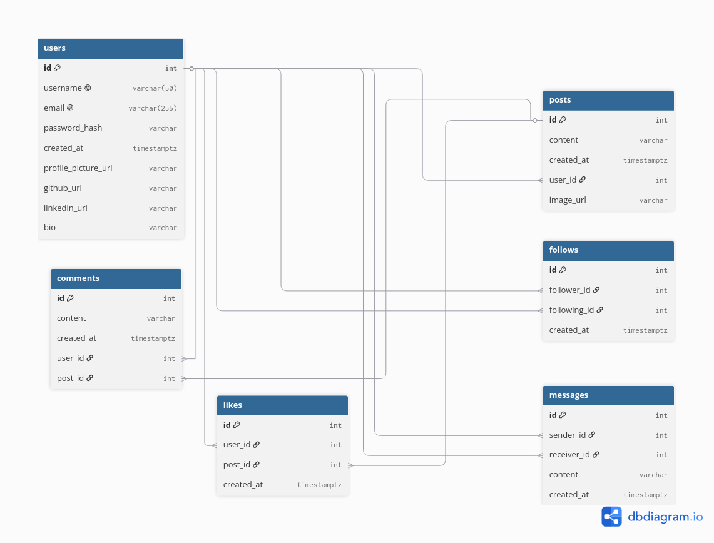

  

Extrovert is a backend-focused social media platform built completely from scratch using
<b>FastAPI</b>, <b>PostgreSQL</b>, and modern backend engineering practices.
The platform provides authentication, social interactions, personalized feeds,
and real-time communication through WebSockets.

<h2>Features</h2>

<table width="100%">

<tr>

<td width="50%">
<h3>Authentication System</h3>
JWT authentication with secure password hashing using bcrypt and role-based access control.
</td>

<td width="50%">
<h3>User Profiles</h3>
Create and manage user profiles with personalized account information.
</td>

</tr>

<tr>

<td width="50%">
<h3>Social Interactions</h3>
Create posts, add comments, like content, and engage with other users.
</td>

<td width="50%">
<h3>Follow System</h3>
Follow and unfollow users to build a personalized social network.
</td>

</tr>

<tr>

<td width="50%">
<h3>Personalized Feed</h3>
Generate customized content feeds based on user connections and activity.
</td>

<td width="50%">
<h3>Real-Time Messaging</h3>
Instant messaging powered by WebSockets for real-time communication.
</td>

</tr>

</table>

<h2>Tech Stack</h2>

<h2>Core Functionalities</h2>

<table width="100%">

<tr>
<th>Feature</th>
<th>Description</th>
</tr>

<tr>
<td><b>Authentication</b></td>
<td>JWT Authentication & Authorization with secure password hashing.</td>
</tr>

<tr>
<td><b>User Management</b></td>
<td>User registration, login, and profile management.</td>
</tr>

<tr>
<td><b>Content System</b></td>
<td>Create posts, comments, and social interactions.</td>
</tr>

<tr>
<td><b>Like System</b></td>
<td>Engage with content through likes.</td>
</tr>

<tr>
<td><b>Follow System</b></td>
<td>Follow and unfollow users.</td>
</tr>

<tr>
<td><b>Feed Generation</b></td>
<td>Personalized content feed generation.</td>
</tr>

<tr>
<td><b>Messaging</b></td>
<td>Real-time messaging using WebSockets.</td>
</tr>

</table>

<h2>Local Setup</h2>

Rename <code>.env.example</code> to <code>.env</code> and add all required environment variables.

<table width="100%">

<tr>
<th width="22%">Setup Method</th>
<th>Description</th>
</tr>

<tr>

<td>
<h3>Docker</h3>
</td>

<td>

<b>1. Build Docker Image</b>

<pre><code>docker build -t extrovert .</code></pre>

<b>2. Run Container</b>

<pre><code>docker run --env-file .env extrovert</code></pre>

</td>

</tr>

<tr>

<td>
<h3>Manual Setup</h3>
</td>

<td>

<b>1. Create Virtual Environment</b>

<pre><code>python -m venv venv</code></pre>

<b>2. Activate Virtual Environment</b>

Linux/macOS

<pre><code>source venv/bin/activate</code></pre>

Windows

<pre><code>venv\Scripts\activate</code></pre>

<b>3. Install Requirements</b>

<pre><code>pip install -r requirements.txt</code></pre>

<b>4. Start Development Server</b>

<pre><code>uvicorn app.main:app --reload</code></pre>

</td>

</tr>

</table>

## Database Schema

  

<h2>Project Goals</h2>

<ul>
<li>Backend-first architecture</li>
<li>Production-ready API design</li>
<li>Secure authentication and authorization</li>
<li>Real-time communication</li>
<li>Scalable database design</li>
<li>Containerized deployment workflow</li>
</ul>

<h2>License</h2>

This project is licensed under the MIT License.

